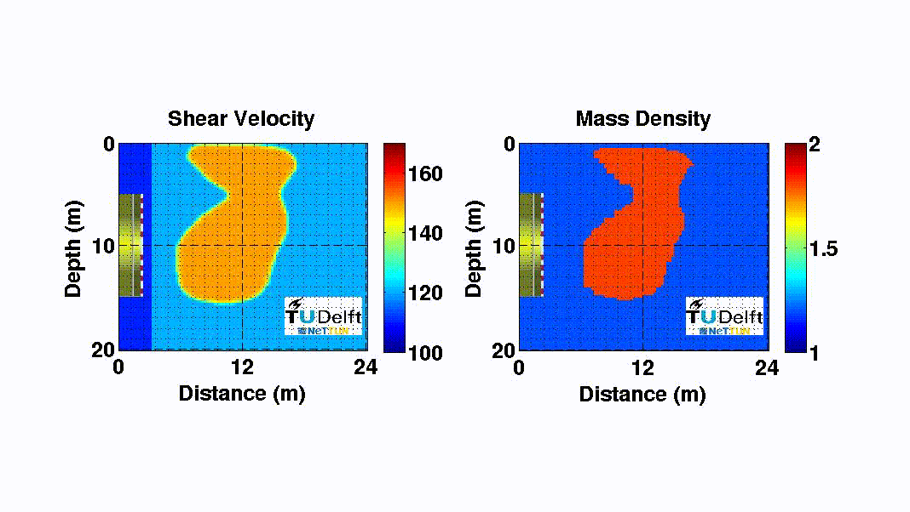

GIF 1: A look-ahead seismic system deployed on the cutter head of a tunnel-boring machine.

I worked on signal models for seismic imaging that incorporate all the physical principles of wave-propagation. 
The algorithms related to these models constitute
full waveform inversion (FWI), which is a popular imaging tool in both exploration and global
seismology. FWI is a non-linear gradient-based optimization procedure that estimates the Earth’s
properties by least-squares fitting of the seismic measurements. The advantage of FWI is
that it could potentially result in an accurate and reliable characterization of complex geological
structures with high resolution. However, as these algorithms aim to explain all details in the
measured seismograms, they are not simple — advanced mathematical techniques
and high performance algorithms are required to process large volumes of seismic data that are
subject to full-waveform models. In other words, gradient-based optimizations are prone to local-
minima convergence, resulting in an imperfect data fitting. Over the last couple of decades several
researches have aimed to develop efficient FWI algorithms with the help of simpler or skeletonized
signal models.

I have developed an auxiliary signal model that assists FWI to produce accurate reconstruction
of the subsurface properties. The formulation of this model effectively involves simplification of
the measurements by replacing the seismic arrivals by bumps. My numerical experiments have
demonstrated that, during the gradient-based optimization, whenever the seismic waveforms are
too complicated to be compared in the conventional least-squares sense, an objective function
based on the simplified data i.e., the bump functional can be useful. In other words, the role
of the bump functional is to guide the optimization towards the global minimum by
pulling the trapped solution out of the local minima associated with the least-squares functional
whenever necessary. The subsequent FWI algorithms that utilize the bump functional lead to an efficient 
multi-objective full waveform inversion.
 

GIF 2: Near-surface imaging using 2-D SH full waveform inversion, where the 
images need to be available in near real time and without human interaction.

<!--
 

-->
